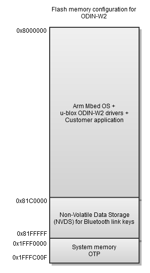

# u-blox ODIN-W2 Wi-Fi and Bluetooth drivers 

This is a pre-compiled binary module including u-blox Wi-Fi and Bluetooth drivers for [Mbed OS](https://mbed.com).

The binary is compiled with the following gcc version:
(GNU Tools for ARM Embedded Processors) 4.9.3 20150529 (release) [ARM/embedded-4_9-branch revision 227977]

The binary is intended for a u-blox ODIN-W2 module.

Please note that this document is not intended as a complete system description. It is intended to be an overview and for details the header files and sample project must be used. If needed Doxygen can be used to generate documentation of the header files, see [documentation](documentation/doxygen/).

**NOTE 1: Bluetooth low energy is currently only experimental.**

**NOTE 2: The Ethernet interface is currently only experimental since it's not possible to set any configuration of an external PHY chip.**

## Related documents
[https://www.u-blox.com/sites/default/files/ODIN-W2_DataSheet_%28UBX-14039949%29.pdf](https://www.u-blox.com/sites/default/files/ODIN-W2_DataSheet_%28UBX-14039949%29.pdf) - ODIN-W2 Data Sheet  
[https://www.u-blox.com/sites/default/files/EVK-ODIN-W2_UserGuide_%28UBX-16007132%29.pdf](https://www.u-blox.com/sites/default/files/EVK-ODIN-W2_UserGuide_%28UBX-16007132%29.pdf) - EVK-ODIN-W2 Evaluation Kit for ODIN-W2 Arm® Mbed™ User Guide

[https://github.com/u-blox/sal-stack-lwip-ublox-odin-w2](https://github.com/u-blox/sal-stack-lwip-ublox-odin-w2) - IP stack(lwIP) for ODIN-W2  
[https://github.com/u-blox/ublox-odin-w2-lwip-adapt](https://github.com/u-blox/ublox-odin-w2-lwip-adapt) - Adaptation layer between lwIP and u-blox Wi-Fi and Bluetooth drivers  
[https://github.com/u-blox/mbed-examples-odin-w2](https://github.com/u-blox/mbed-examples-odin-w2) - Example applications  

## Overview

The ODIN-W2 module supports a variety of interfaces such as WLAN, Bluetooth, Bluetooth low energy, RMII (Ethernet), SPI, UART, CAN, I2C, GPIOs, Analog input pins, and JTAG/SWD. Many of the interfaces and IO pins are multiplexed. For details see the [ODIN-W2 Data Sheet](https://www.u-blox.com/sites/default/files/ODIN-W2_DataSheet_%28UBX-14039949%29.pdf).

The embedded Bluetooth Stack and the embedded WLAN driver are optimized for small embedded industrial systems with high requirements on performance and robustness. The Bluetooth stack contains the classic SPP, DUN, PAN, DID and GAP profiles and the low energy GATT, GAP and u-blox Serial Port Service. The Wi-Fi driver contains station as well as access point. A supplicant is also included.

The drivers are not thread safe. This means that all calls to and from the drivers must be serialized to ensure that there are never more than one concurrent entry point called in the drivers. This can be achieved by posting function calls to the [minar scheduler](https://github.com/ARMmbed/minar). All callbacks of the drivers run in the context of minar unless stated otherwise. The entry point, app_start, of an Mbed OS application is also called from minar.

The exported components and corresponding files in the u-blox ODIN-W2 driver is shortly described below.

### Common
- **Main**(cb\_main.h) - Initialization of Wi-Fi, Bluetooth and Ethernet drivers
- cb\_comdefs.h - Commonly used definitions like TRUE/FALSE
- cb\_status.h - Common status codes
- cb\_watchdog.h - Hardware watchdog
- cb\_otp.h - Read One-Time Programmable(OTP) parameters like MAC addresses. 

### Bluetooth
- **BT Manager**(cb\_bt\_man.h) - Bluetooth Generic Access Profile(GAP) functionality like inquiry, device name etc
- **BT Connection Manager**(cb\_bt\_conn\_man.h) - Setting up and tearing down Bluetooth SPP/PAN/DUN connections
- **BT Security Manager**(cb\_bt\_sec\_man.h) - Security manager that handles pairing and link keys. **NOTE, this API is subject to change for the next release.**
- **BT PAN**(cb\_bt\_pan.h) - Personal Area Network Profile(PAN) for sending Ethernet frames over Classic Bluetooth
- **BT Serial**(cb\_bt\_serial.h) - Serial Port Profile(SPP) based on RFCOMM for sending and receiving transparent data. Also supports Dial-Up Network(DUN).
- **BT Serial low energy**(cb\_bt\_serial\_le.h) - u-blox Serial Port Service for sending and receiving transparent data.
- cb\_gatt.h - Common GATT for low energy functionality
- cb\_gatt\_client.h - GATT client functionality, typically used by a central
- cb\_gatt\_server.h - GATT server functionality, typically used by a peripheral
- cb\_gatt\_utils.h - Utility functions for GATT
- bt\_types.h - Common Bluetooth types that are used by several components
- cb\_bt\_utils.h - Utility functions like comparing Bluetooth addresses

For more info about the Bluetooth components see [documentation/readme_bluetooth.md](documentation/readme_bluetooth.md).

### Wi-Fi
- **WLAN API**(cb\_wlan.h) - Scanning, connection setup, maintenance and termination
- cb\_wlan\_types.h - WLAN types
- cb\_wlan\_target\_data.h - WLAN target that handles packetization of Ethernet frames
- cb\_platform\_basic\_types.h - Common definitions for a GCC compatible compiler
- cb\_port\_types.h - WLAN types
- cb\_types.h - Common types

For more info about the Wi-Fi component look [here](documentation/readme_wifi.md).

### Ethernet
- **Ethernet API**(cb\_ethernet.h) - Ethernet driver. NOTE, this API is subject to change for the next release since the functionality is experimental. See test app for usage.

### TCP/IP stack
Any TCP/IP stack can be used together with the driver but a ready to use [lwIP stack](http://savannah.nongnu.org/projects/lwip/) has been tested and is provided as a separate module [here](https://github.com/u-blox/sal-stack-lwip-ublox-odin-w2). It has been slightly modified to better suite the Wi-Fi driver.

To make it easier to customize the usage of the lwIP stack an adaptation module has been added and can be found here [https://github.com/u-blox/ublox-odin-w2-lwip-adapt](https://github.com/u-blox/ublox-odin-w2-lwip-adapt). For example, if layer 2 routing is needed it is highly recommended to fork the adaptation module or completely replace it.

### Mbed OS
This is the Arm Mbed OS framework and is a collection of OS-related modules and includes the [minar scheduler](https://docs.mbed.com/docs/getting-started-mbed-os/en/latest/Full_Guide/MINAR/), control of GPIOs, UART, SPI, I2C, security etc. A thorough description can be found [here](https://docs.mbed.com/docs/getting-started-mbed-os/en/latest/)

### ST firmware library
A subset of the functionality provided by the ST firmware library is accessible from Mbed OS. If more control is needed it's also possible to access the drivers directly via the [mbed-hal-st-stm32cubef4 module](https://github.com/ARMmbed/mbed-hal-st-stm32cubef4). Note that it must be used with care since any misusage might break the driver and/or Mbed OS.

### Deprecated API
- cb_assert.h - use Mbed assert instead
- cb_hw.h - use Mbed functions instead

## Qualification and approvals
The module fulfills the ETSI regulations and modular approved for FCC and IC. It is also Bluetooth qualified as a Bluetooth controller subsystem. The embedded Bluetooth stack is pre-qualified as a Bluetooth host subsystem. This allows for customer specific Bluetooth applications developed directly for the STM32F439 microcontroller. For more info see Qualification and approvals chapter in [ODIN-W2 Data Sheet](https://www.u-blox.com/sites/default/files/ODIN-W2_DataSheet_%28UBX-14039949%29.pdf).

## Development and Debugging Environment
The build tool used for compiling and linking the driver is [yotta](https://www.mbed.com/en/development/software/mbed-yotta/).

When linking an application with the driver, all modules that the driver depends on must be of a specific version. The reason for this is that the driver can only be guaranteed to work with the fixed versions that we have verified during release tests.

Examples of how to set-up and debug an application can be found here [https://github.com/u-blox/mbed-examples-odin-w2](https://github.com/u-blox/mbed-examples-odin-w2).

## Flash memory configuration

The flash memory configuration above shows how the utilization can look like when two 128k sectors are used as non-volatile storage of link keys. How much space the Arm Mbed OS and ODIN-W2 drivers occupy is very dependent on how much functionality is used. The [Wi-Fi example](https://github.com/u-blox/mbed-examples-odin-w2/tree/master/udp-time-client-wifi) will occupy around 1MByte.

No boot, starting at address 0, is used in this flash configuration as this is typically overwritten when using the ST-LINK mass storage flashing on the EVK-ODIN-W2.

**NOTE 3: The One Time Programmable(OTP) area is reserved for the ODIN-W2 drivers and must not be written to. The OTP area keeps all the MAC addresses.**

**NOTE 4: The two flash sectors are not included in the linker script which means that there will be no warning if the BT link keys flash area collides with the application. The binary must be checked afterwards to ensure it fits together with the two last sectors of 128*2=256KByte.**

## RAM
The ODIN-W2 drivers use both static RAM and dynamically allocated heap memory via the Mbed OS module [ualloc](https://github.com/ARMmbed/ualloc). The heap usage is heavily dependent on the use case.

## Hardware watchdog
The hardware watchdog is neither initialized nor enabled by default but can be added via the cb_watchdog.h API.

## Power management
Low power mode is currently enabled by default for the MCU and the Wi-Fi radio. It is not enabled for the Bluetooth radio since the idle power consumption is much lower than Wi-Fi anyway. For the Wi-Fi radio it's possible to finetune the behavior via the cbWLAN_ioctl function in cb_wlan.h.

## Hardware resources
Both the Bluetooth stack and the Wi-Fi driver use parts of the hardware. The table below shows the dependencies to those resources.

| HW resource           | Component          | Description                                                                                                        |
|-----------------------|--------------------|--------------------------------------------------------------------------------------------------------------------|
| GPIO                  | ODIN-W2            | Only IO pins that are included in the ODIN-W2 target can be used.                                                  |
| System tick interrupt | ODIN-W2 timers/HAL | The system tick is used by the ODIN-W2 internal timer component and also by the ST firmware lib.                         |
| TIM2                  | minar              | Timer used by the minar scheduler yotta module                                                                     |
| TIM3                  | ODIN-W2            | Used by the Bluetooth HCI UART                                                                                     |
| DMA5, DMA6            | ODIN-W2            | DMA stream 5 and 6 are used by the Bluetooth HCI UART                                                               |
| USART2                | ODIN-W2            | Used by the Bluetooth HCI UART                                                                                     |
| IWDG                  | ODIN-W2            | The independent watchdog is setup using cbWD. Disabled by default. Can be emitted by not initializing the component. |
| Ethernet              | ODIN-W2            | TBA                                                                                                                |
| SDIO                  | ODIN-W2            | TBA                                                                                                                |
| Flash memory          | ODIN-W2            | Bluetooth link keys are stored in the last two sectors. OTP is reserved for the ODIN-W2 drivers.                   |
