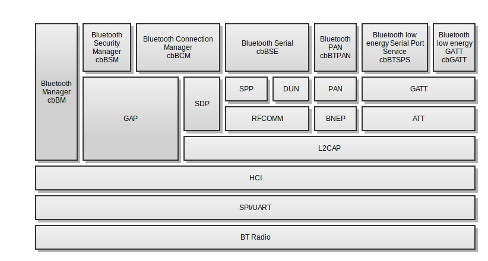

# u-blox Embedded Bluetooth Stack
The u-blox Embedded Bluetooth Stack is optimized for small embedded industrial systems with high requirements on performance and robustness. It is also pre-qualified for Bluetooth 4.0+EDR and contains the following classic profiles; SPP, DUN, PAN (role PANU and NAP,  DID and GAP. For Bluetooth low energy GAP, GATT and DIS are pre-qualified.
Direct function calls and callbacks are used as much as possible and message passing and critical sections are used sparsely. All Bluetooth stack processes are running in the same context therefore mutual exclusions are not required for the different callbacks from the stack to the application.
The block diagram below shows the different modules in the stack.

The top modules cbBM, cbBSM, cbBCM, cbBSE, cbBTSPS, cbGATT and cbBTPAN above are exported via the API and they are described below. The other modules are internal and thus not accessible by the application. The functions/callbacks are described in the header files.

## Bluetooth Qualification
The stack is pre-qualified for the following profiles and protocols:

- SPP  
- DUN  
- PAN (Role PANU and NAP)  
- BNEP  
- GAP  
- SDP  
- RFCOMM  
- L2CAP  
- HCI  
- DID  
- DIS  
- SM  
- ATT  
- GATT  

## Bluetooth Manager(cbBM)
The Bluetooth Manager takes care of static configuration of the Bluetooth stack e.g. local name, class of device, connectable modes etc. Procedures for inquiry and device name are also found here.
## Bluetooth Connection Manager(cbBCM)
This module contains functionality for establishing and tear down a connection to a remote Bluetooth device. The connection can be of different types, ACL connection, low energy connection or profile connection e.g. SPP.

Several connections can be active in parallel. They are separated by the use of a handle which is provided by the stack upon outgoing/incoming connection.

When an ACL/profile connection is set up, security might be needed depending on what Bluetooth version and security requirements the remote and local side is using. The security requirements depend on what protocol/profile is being used. For example, when using SDP it is likely that no security is needed while setting up RFCOMM will involve security. See Bluetooth Security chapter for more info on how security works.

Once a connection has been established, data can be sent to and from the remote device using the Bluetooth Serial(cbBSE) component.
This component also takes care of registering SDP database records and service searching.

An SDP client is a device that is searching for remote services while an SDP server is holding a service record to be found by remote devices. Therefore, if a device acts only as a client, it does not need to register an SDP service record. A single device can function both as an SDP server and as an SDP client.

Note that service records can only be added, not removed. When the device is reset all service records are removed.

The sequence diagram below shows the calls and events used in a successful connection setup and disconnect of a Bluetooth Serial Profile link. The connection is initiated by the application using the Connection Manager and when the connection is established the application receives the connect event callback and opens a corresponding data channel in Bluetooth Serial. When a disconnect occurs the application receives a disconnect event from the Connection Manager and a closed event from the the Bluetooth Serial when all data for the channel is consumed.

## Bluetooth Serial(cbBSE)
The Bluetooth Serial component provides a generic data packet interface for SPP and DUN. After a connection has been set up using the Connection Manager a data packet channel can be opened. The data packet channel will be automatically closed when a disconnection occurs. The sequence diagram below shows how data is sent to and received from a remote device using a Bluetooth Serial Port link. For each write operation a write confirmation is received. When data is received from the remote device the application receives a data available event. When the application receives the data available event it fetches the data using the cbBSE_getReadbuf function and then, when the data has been processed calls the cbBSE_readBufConsumed function to notify that the underlying buffers can be reused. Note that the sample code for connection establishment and data transfer is available in the sample applications.

## Bluetooth Security(cbBSM)

## Bluetooth Personal-Area Network(cbBTPAN)

## Bluetooth low energy Serial Port Service(cbBTSPS)
TBA

## Bluetooth low energy Generic Attribute Profile(cbBTGATT)
TBA

## Bluetooth Test Manager(cbBTM)
This component is used for testing different radio characteristics and assure that radio approvals are followed.
