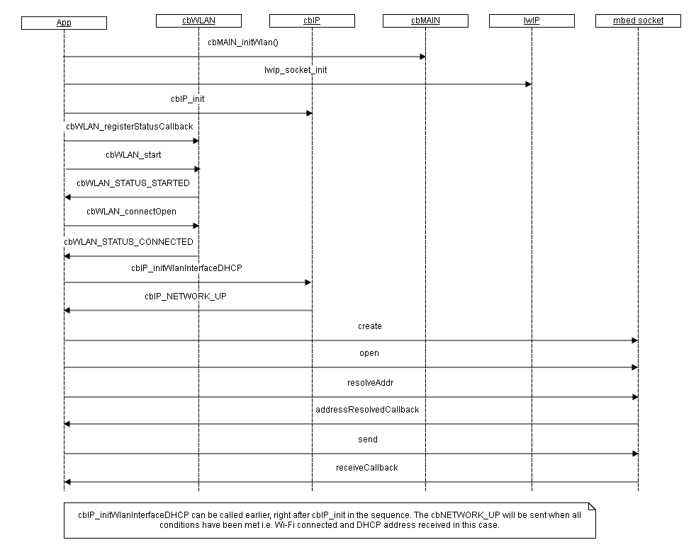
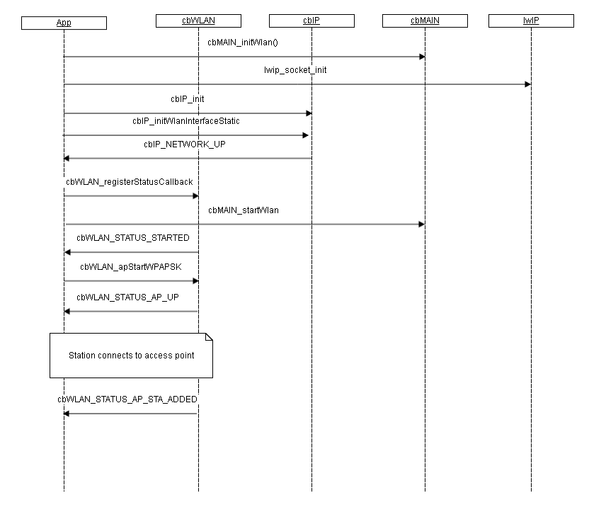

# u-blox Wi-Fi driver
The Wi-Fi driver provides functionality to initialize, configure and manage a Wireless LAN connection using the ODIN-W2 module. A supplicant is included to enable authentication and encryption handling.

The Wi-Fi support conforms to IEEE 802.11a/b/g/n and has dual-band 2.4 GHz and 5GHz operation. The driver can either operate as a Station or an Access Point.

The Wi-Fi driver is typically used together with a TCP/IP stack. For the ODIN-W2 drivers we have added two additional yotta modules that holds the [lwIP stack](https://github.com/u-blox/sal-stack-lwip-ublox-odin-w2) and an [adaptation layer](https://github.com/u-blox/ublox-odin-w2-lwip-adapt). There is also a [Wi-Fi example](https://github.com/u-blox/mbed-examples-odin-w2) that shows how to use all three modules.

## General initialization
The Wi-Fi driver is initialized with a call to cbMAIN\_initWlan. Note that cbWLAN\_init must not be called since this is done from inside cbMAIN\_initWlan.

In order to get status updates it's necessary to register via the cbWLAN\_registerStatusCallback function.

Once the driver has been initialized and a status handler been registered it can be started with cbMAIN\_startWlan. When starting is finished a status event/callback is received.

If the driver is not intended to be in use anymore it is wise to stop it with cbWLAN\_Stop to lower power consumption.

## Station mode
The station mode is entered by calling any of the cbWLAN\_connectXXX functions. Whenever a connection is dropped the application will be notified and the driver will re-connect until a connection is reestablished. The connection can be cancelled or terminated by calling cbWLAN\_disconnect.

Although a scan is not neccessary prior to a connection establishment it might be required if full information about the access point is needed.

The sequence diagram below shows a typical scenario from an uninitialized driver to sending some socket data via the lwIP stack.

## Access Point mode
The access point mode is entered by calling any of the cbWLAN_apStart* functions. Whenever a connection is established an event cbWLAN_STATUS_AP_ADDED is received. A corresponding cbLWAN_STATUS_AP_REMOVED is called when the station disconnects.

The sequence diagram below shows a typical scenario from an uninitialized driver to connected station. See wifi-ap test app for more info.

